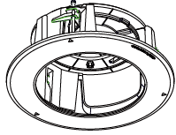
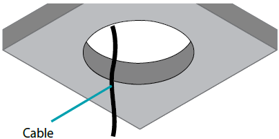
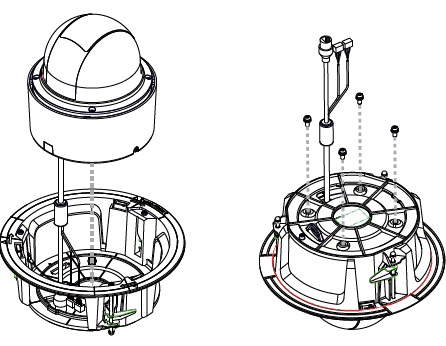
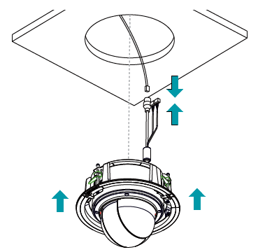
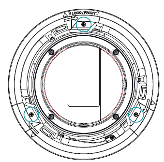
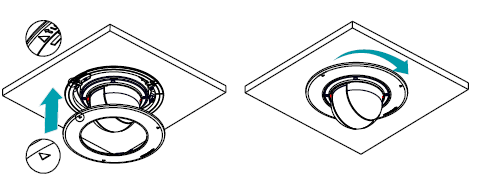

# DA-FM4700 Installation Guide

## About This Project

This repository contains a camera mount installation guide that I created while working at IDIS.

The guide explains the installation process using both text and images to help users understand the procedure more easily.

## My Role

- Created installation guide content
- Edited layout and images
- Reviewed English documentation
- Worked with developers to verify technical information

### Tools

- Adobe InDesign
- Adobe Illustrator
- GitHub Markdown

# DA-FM4700 Ceiling Mount Bracket Installation Guide

## Overview

This guide explains how to install the DA-FM4700 ceiling mounting bracket for the camera system.

### Compatible Camera

* DC-S4561WRA

### Important Notes

* Installation must be performed by qualified personnel.
* Follow all local installation regulations.
* Reinforce the ceiling if necessary.
* Do not use the bracket for purposes other than its intended use.

---

## Required Installation Space

Minimum hole diameter:

* Ø215 mm (8.5 in)

---

## Installation Procedure

### Step 1. Prepare the Mounting Hole

Create a ceiling opening using the provided guide pattern.

Route the network and power cables through the cable hole.

---

### Step 2. Assemble the Camera and Bracket

Before installation:

1. Align the camera body and DA-FM4700 bracket.
2. Match the alignment guides.
3. Fasten using the supplied screws.

---

### Step 3. Connect Cables

Connect:

* Network cable
* Required peripheral cables

Push the camera body into the bracket until flush mounted.

If required by the installation environment, connect a safety cable using the provided hook and screw fastener.

---

### Step 4. Secure the Product

After flush mounting:

1. Align the product with the logo direction.
2. Tighten the three clamp screws clockwise.

---

### Step 5. Attach the Top Cover

1. Attach the top cover to the bottom cover.
2. Rotate clockwise until fully secured.

---

## Dimensions

| Specification     | Size    |
| ----------------- | ------- |
| Outer Diameter    | Ø258 mm |
| Installation Hole | Ø215 mm |
| Inner Diameter    | Ø168 mm |
| Height            | 90 mm   |

---

## Version

Version 1.0
